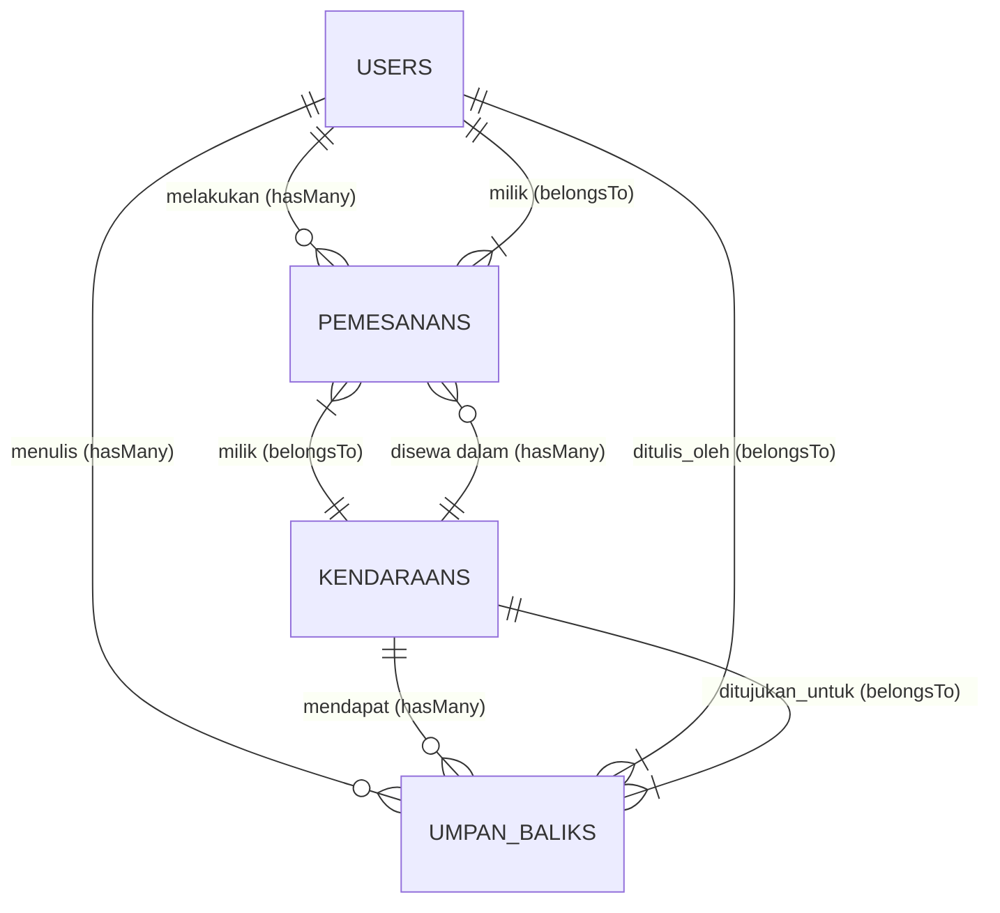

# Struktur Skema Database: Sistem Rental Kendaraan

Berikut adalah struktur tabel relasi *database* dari Sistem Rental Kendaraan ini berdasarkan Model yang ada:

### **1. Tabel `users`**
Menyimpan data otentikasi dan profil pengguna maupun admin.

| Nama Kolom | Tipe Data / Casting | Keterangan |
| :--- | :--- | :--- |
| `id` | BigInt / Unsigned | *Primary Key* |
| `name` | String | Nama lengkap pengguna |
| `email` | String | Alamat email (Unik) |
| `password` | String (Hashed) | Kata sandi yang di-hash |
| `nik` | String | Nomor Induk Kependudukan |
| `no_hp` | String | Nomor Handphone |
| `alamat` | String | Alamat tempat tinggal |
| `is_admin` | Boolean | *Flag* penanda level Admin (0 = User, 1 = Admin) |
| `profile_photo` | String | *Path* foto profil |
| `cover_photo` | String | *Path* foto sampul |
| `deletion_requested_at`| Datetime | Waktu permintaan hapus akun permanen |
| `email_verified_at`| Datetime | Waktu verifikasi email |
| `remember_token` | String | Token sesi *login* otomatis |
| `created_at` | Datetime | Tanggal akun dibuat |
| `updated_at` | Datetime | Tanggal pembaruan profil terakhir |

---

### **2. Tabel `kendaraans`**
Menyimpan data katalog armada kendaraan (mobil/motor).

| Nama Kolom | Tipe Data / Casting | Keterangan |
| :--- | :--- | :--- |
| `id` | BigInt / Unsigned | *Primary Key* |
| `nama_kendaraan` | String | Nama merek dan model kendaraan |
| `tipe` | String | Tipe kendaraan |
| `kategori` | String | "Mobil" atau "Motor" |
| `harga_sewa` | Integer | Harga sewa per hari |
| `stok` | Integer | Jumlah kendaraan tersedia |
| `rating` | Float / Double | Rata-rata bintang |
| `deskripsi` | Text | Deskripsi tentang kendaraan |
| `gambar_utama` | String | *Path* gambar sampul utama kendaraan |
| `gambar_galeri` | Array (JSON) | Daftar gambar-gambar tambahan kendaraan |
| `spesifikasi` | Array (JSON) | Spesifikasi mesin, *seats*, bahan bakar, transmisi |
| `created_at` | Datetime | Tanggal ditambahkan |
| `updated_at` | Datetime | Terakhir diperbarui |

---

### **3. Tabel `pemesanans`**
Menyimpan data riwayat *booking* (transaksi).

| Nama Kolom | Tipe Data / Casting | Keterangan |
| :--- | :--- | :--- |
| `id` | BigInt / Unsigned | *Primary Key* |
| `user_id` | BigInt / Unsigned | *Foreign Key* → Mengacu ke `users.id` |
| `kendaraan_id` | BigInt / Unsigned | *Foreign Key* → Mengacu ke `kendaraans.id` |
| `tanggal_mulai` | Date | Tanggal pengambilan kendaraan |
| `tanggal_selesai` | Date | Tanggal pengembalian kendaraan |
| `durasi_hari` | Integer | Total durasi penyewaan |
| `total_biaya` | Integer | Total biaya yang harus dibayar |
| `status` | String | "Menunggu Pembayaran", "Berjalan", "Selesai", dll |
| `denda` | Integer | (Opsional) Nominal denda bila telat |
| `alasan_batal` | String | (Opsional) Alasan bila pesanan dibatalkan |
| `created_at` | Datetime | Waktu transaksi dibuat |
| `updated_at` | Datetime | Terakhir status di-*update* |

---

### **4. Tabel `umpan_baliks`**
Menyimpan data ulasan (ulasan rating) dari penyewa.

| Nama Kolom | Tipe Data / Casting | Keterangan |
| :--- | :--- | :--- |
| `id` | BigInt / Unsigned | *Primary Key* |
| `user_id` | BigInt / Unsigned | *Foreign Key* → Mengacu ke `users.id` |
| `kendaraan_id` | BigInt / Unsigned | *Foreign Key* → Mengacu ke `kendaraans.id` |
| `rating` | Integer | Nilai bintang (1 hingga 5) |
| `komentar` | Text | Komentar tertulis umpan balik |
| `created_at` | Datetime | Waktu ulasan di-*submit* |
| `updated_at` | Datetime | - |

---

### **Diagram Hubungan Kunci Relasional (ERD) / Eloquent Relation:**

